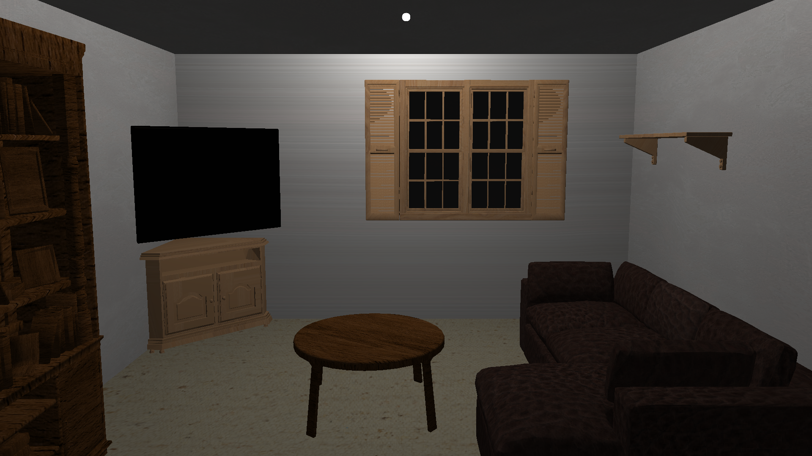
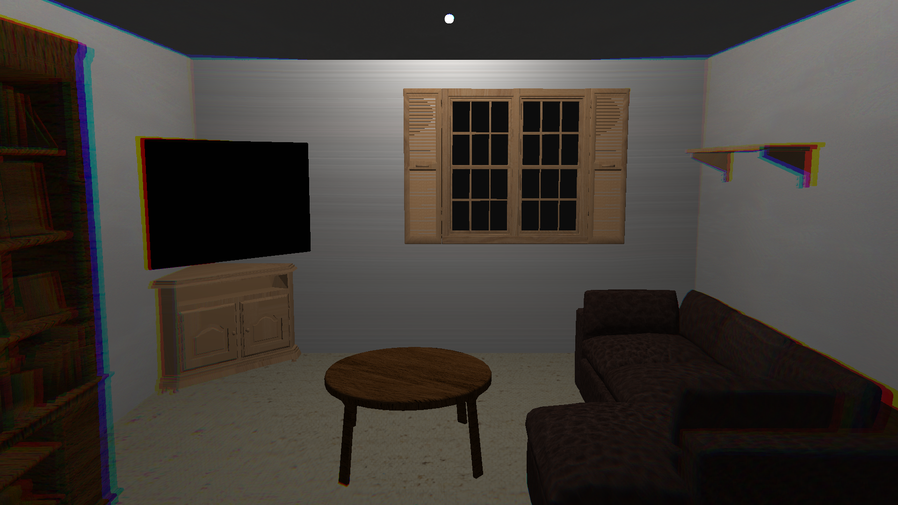
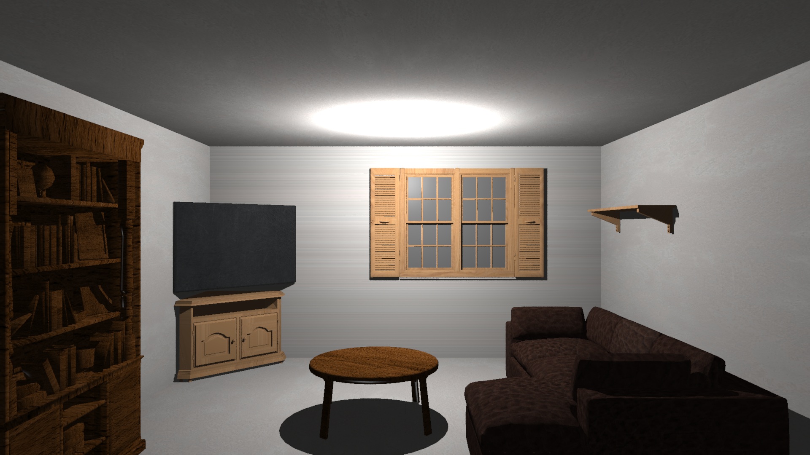
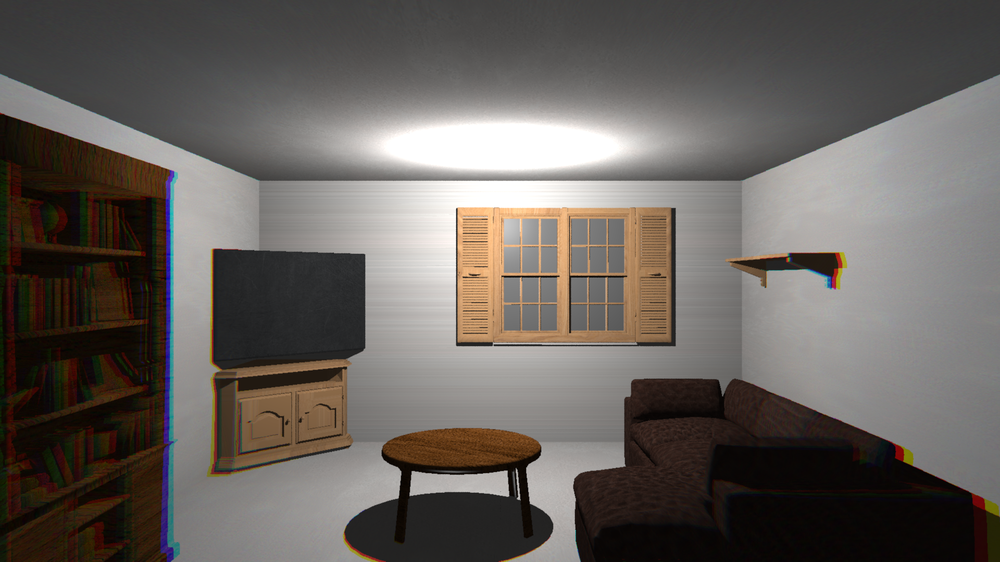

# Graphics Rendering Portfolio

*Developed by Jacob Beason Entwistle as part of a Computer Graphics module.*

https://github.com/user-attachments/assets/db6abf72-f608-4175-a951-228048971c1b

Each system explores different rendering techniques and pipelines, ranging from real-time rasterisation to physically-based ray tracing and reference path-traced rendering.

## Overview

The project demonstrates multiple approaches to 3D rendering, implemented as separate systems:

- A software rasteriser for real-time triangle rendering
- A ray tracer featuring acceleration structures and physically-based shading
- A Blender Cycles path-traced scene used as a high-quality reference render

Each renderer operates independently with its own scene setup and pipeline implementation.

## Rendering Systems
### Rasteriser (Real-time Pipeline)
A software rasterisation renderer implementing a traditional graphics pipeline for real-time triangle rendering.

#### Results

**Final frame output (living room scene)**

| Without Chromatic Aberration | With Chromatic Aberration |
| - | - |
|  |  |

**Rasterisation process (mesh-by-mesh draw order)**

This animation shows the rasteriser drawing each mesh in the scene (*Phasmophobia - 6 Tanglewood Drive, living room*), illustrating draw order, depth testing, and material assignment.

https://github.com/user-attachments/assets/55c9feec-f0f6-4d3d-94f4-3135fddcc384

#### Key capabilities:

- Triangle-based rendering with depth testing and back-face culling
- Perspective projection camera system
- Texture-mapped geometry with material support
- Multi-material shading model per object
- Custom image output pipeline

#### Highlights:
- Z-buffered visibility handling
- Multi-light support (including point lighting)
- Post-processing effects including chromatic aberration
- Designed around extensible per-material shading

### Ray Tracer (Physically-based CPU Renderer)
A CPU ray tracing system built around geometric intersection and physically-based shading models.

#### Results

**Final frame output (physically-based shading)**

| Without Chromatic Aberration | With Chromatic Aberration |
| - | - |
|  |  |

**Ray tracing process (progressive refinement)**

https://github.com/user-attachments/assets/e301f42f-694a-431f-af75-d37433933d2f

#### Key capabilities:
- Ray generation from a perspective camera
- Ray–triangle intersection with hit resolution
- Scene loading with geometry and materials
- Texture and material-based shading

#### Highlights:
- BVH acceleration structure for significantly reduced intersection cost
- Phong-based textured shading model
- Glass materials supporting reflection and refraction
- Supersampled anti-aliasing for improved image quality
- Gamma-corrected colour output for accurate display rendering
- Chromatic aberration for perceptual realism adjustments

## Shared Resources
- assets/models/ - OBJ-based mesh assets and scene geometry
- assets/textures/ - Material and surface texture maps
- assets/3rdParty/ - External libraries and dependencies

## Technologies Used
- C++
- Eigen (math library)
- LodePNG (image output)
- Custom rendering pipelines
- Blender Cycles (path-tracing reference)

## Notes
Each renderer is fully independent and can be compiled and executed separately.
The repository is structured to demonstrate different approaches to computer graphics rather than a single unified engine.
